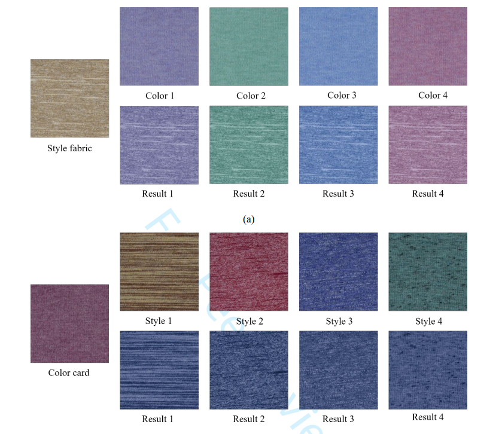

# FabricStyleTransfer

A genetic algorithm (GA) and A style-generative adversarial networks (StyleGAN) based method was adopted to realize the color transfer of colored spun yarned fabrics.

The source code will be coming soon.
